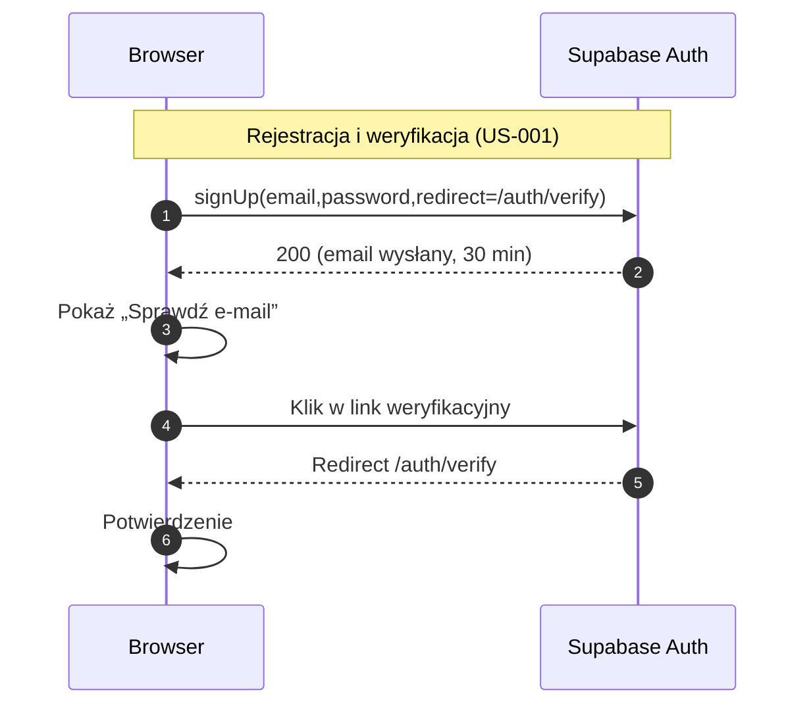
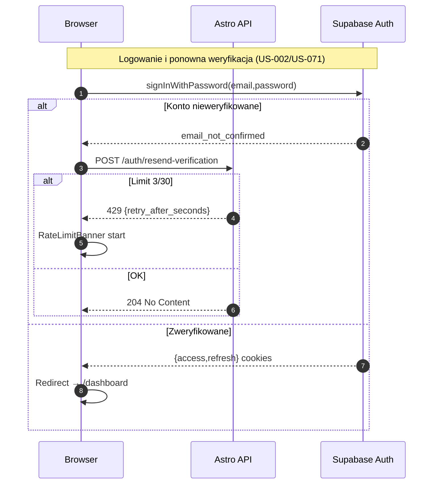
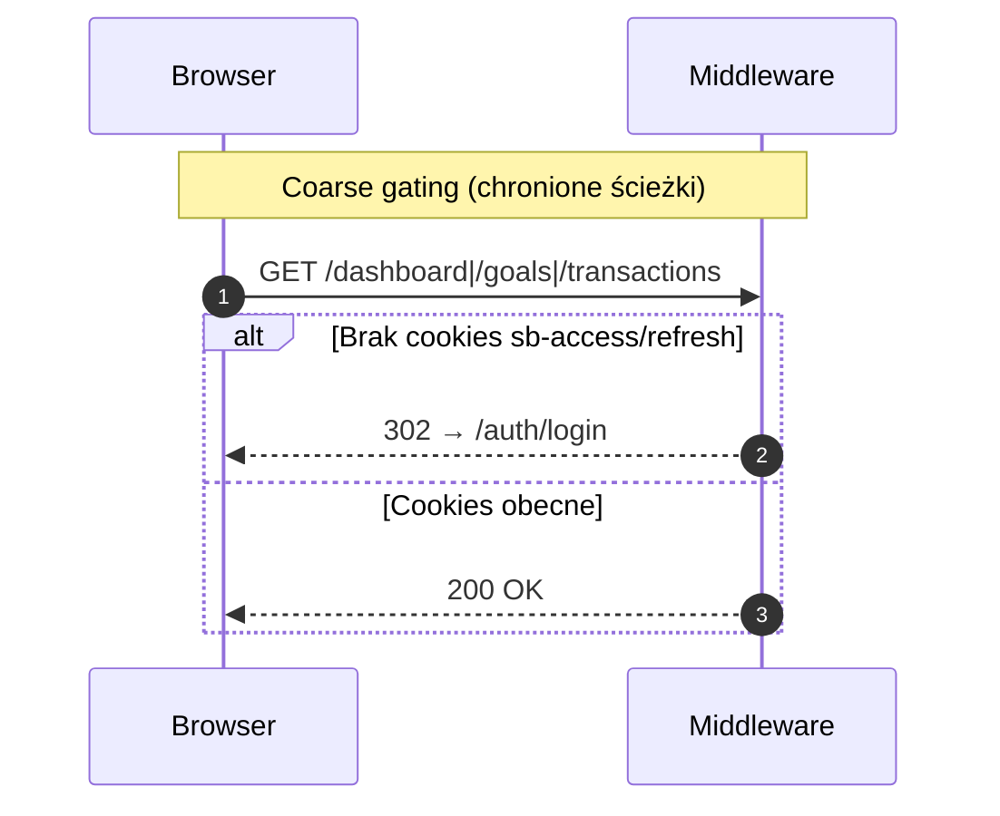
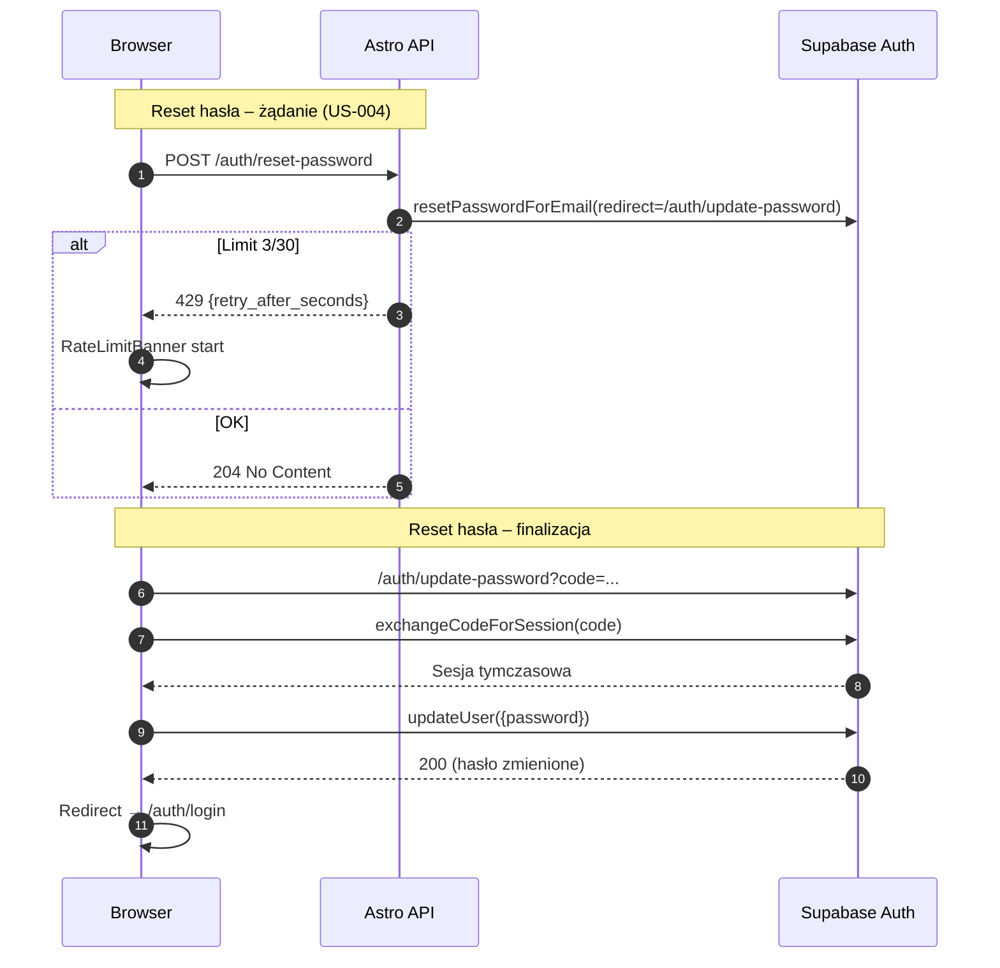
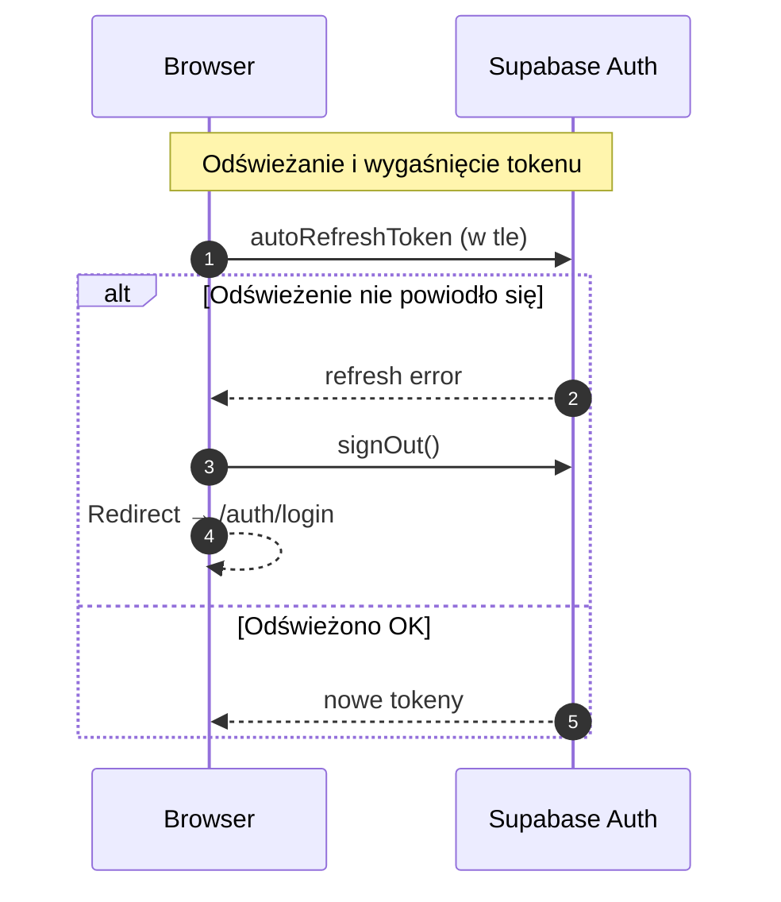
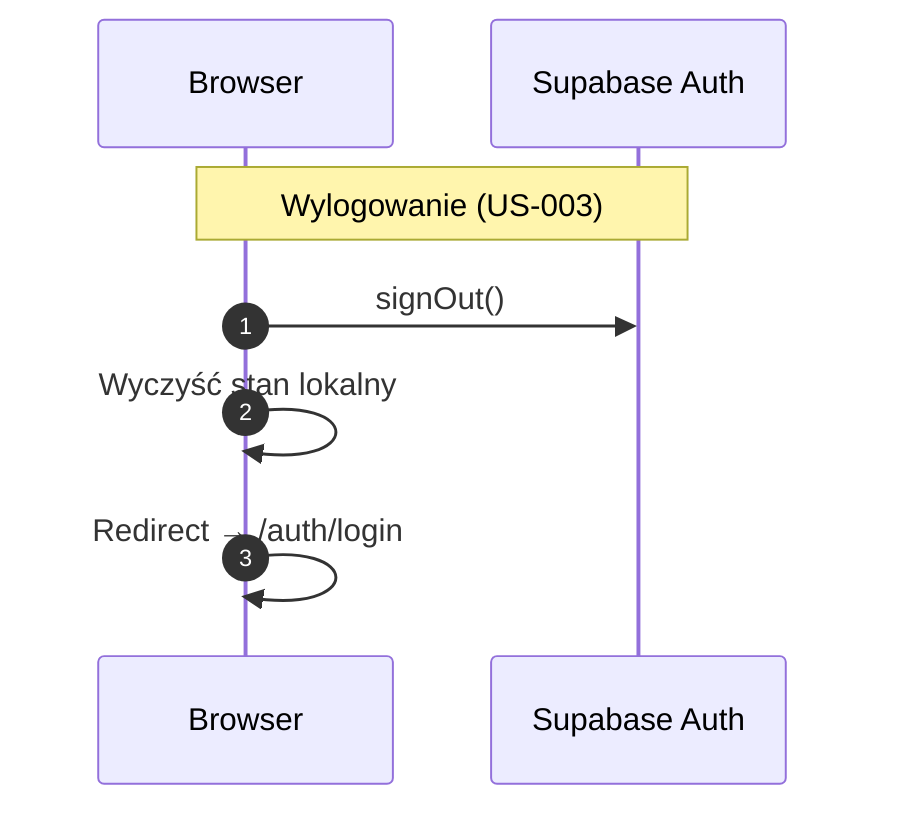

<authentication_analysis>

- Przepływy autentykacji (wg PRD i spec):
  - Rejestracja z e‑mailem weryfikacyjnym (US‑001).
  - Weryfikacja e‑mail (klik w link → ekran /auth/verify).
  - Logowanie e‑mail/hasło (US‑002) z obsługą konta nieweryfikowanego.
  - Coarse gating w middleware na podstawie cookies Supabase.
  - Wylogowanie (US‑003) i redirect do /auth/login.
  - Reset hasła: żądanie (limit 3/30) + finalizacja po kodzie (US‑004).
  - Ponowna wysyłka weryfikacji (limit 3/30) (US‑033/US‑071).
  - Odświeżanie tokenu po stronie przeglądarki (autoRefreshToken).
  - Wygaśnięcie tokenu i reakcja (signOut + redirect).

- Aktorzy:
  - Przeglądarka (React + @supabase/supabase-js).
  - Middleware (Astro) – coarse gating, bez SSR danych domenowych.
  - Astro API (tylko operacje z limitami: reset/resend).
  - Supabase Auth (signUp/signIn/signOut, verify, reset, refresh).

- Tokeny i odświeżanie:
  - Przeglądarka: persistSession=true, autoRefreshToken=true (po wdrożeniu
    `src/db/supabase.browser.ts`).
  - Middleware: wykrywa obecność cookies `sb-access-token`/`sb-refresh-token`
    i w razie braku przekierowuje na /auth/login (heurystyka).
  - Brak pełnej weryfikacji tokenu po stronie serwera (MVP); sesja domykana
    w kliencie. Błąd odświeżenia → signOut + redirect.

- Opis kroków (skrót):
  - Rejestracja: Browser → Auth: signUp(..., emailRedirectTo=/auth/verify),
    e‑mail ważny 30 min, neutralne komunikaty.
  - Logowanie: Browser → Auth: signInWithPassword; jeśli brak weryfikacji,
    CTA „Wyślij ponownie” przez API (limit 3/30). Gdy ok, redirect /dashboard.
  - Gating: wejście na chronione ścieżki bez cookies → 302 do /auth/login.
  - Reset: Browser → API: reset-password (limit) → Auth wysyła link z
    redirectTo=/auth/update-password; finalizacja przez exchangeCodeForSession
    + updateUser({ password }).
  - Wylogowanie: Browser → Auth: signOut(); redirect /auth/login.

</authentication_analysis>

<mermaid_diagram>

</mermaid_diagram>

<mermaid_diagram>

</mermaid_diagram>

<mermaid_diagram>

</mermaid_diagram>

<mermaid_diagram>

</mermaid_diagram>

<mermaid_diagram>

</mermaid_diagram>

<mermaid_diagram>

</mermaid_diagram>

